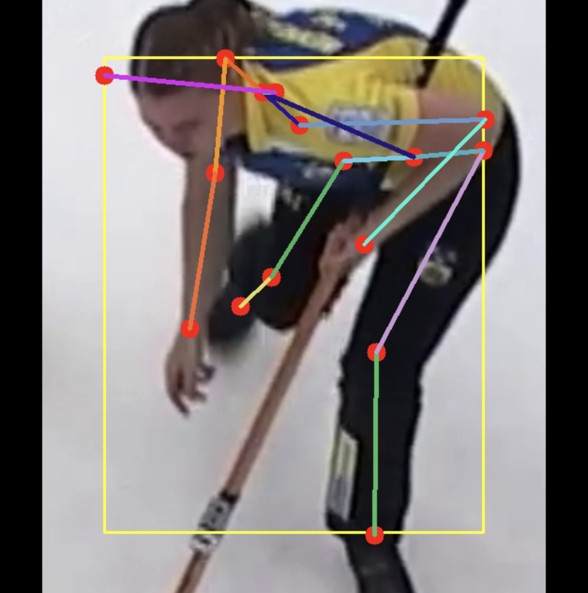

# Pose-Estimation-Pipeline

This codebase is a simple pipeline for single person pose estimation (aka. human keypoint detection).

## Data Preparation

convert the COCO format dataset into single-person images and annotations. 

Some examples are shown as below:

  
  
  
  
  

